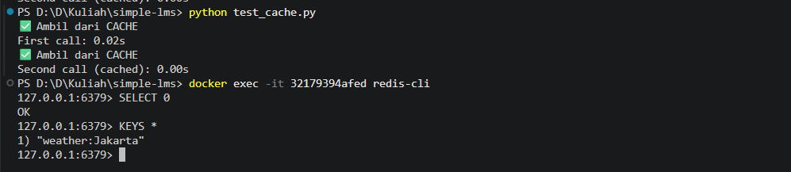

# Simple LMS - Project Foundation & API Implementation

Project ini adalah pengembangan Learning Management System (LMS) sederhana yang dibangun menggunakan **Django** dan dikontainerisasi menggunakan **Docker**. Fokus utama pada project ini adalah arsitektur backend, koneksi database, autentikasi JWT, caching, rate limiting, serta logging menggunakan MongoDB.

---

## 🎯 Fitur & Cakupan

* **Containerization:** Berjalan di atas Docker (PostgreSQL, Redis, MongoDB, Django).
* **Custom User Model:** Role-based access (Student & Instructor).
* **RESTful API:** CRUD lengkap untuk Course, Lesson, Category, dan Enrollment.
* **JWT Authentication:** Keamanan akses menggunakan JSON Web Token.
* **Redis Caching:** Optimasi performa API (course list & detail).
* **Rate Limiting:** Pembatasan request (60 request/menit per IP).
* **MongoDB Logging:** Penyimpanan activity log untuk analisis.
* **Auto-Generated Documentation:** Swagger UI untuk pengujian API.

---

## 📸 Dokumentasi Sistem

### 1. Django Welcome Page & Admin


---

### 2. Log Sistem & Migrasi

.png)


---

### 3. API Documentation (Swagger UI)


---

### 4. Autentikasi & Authorization (JWT)


---

### 5. Hasil Endpoint (200 OK)


---

### 6. Rate Limiting (Redis)

Jika request melebihi batas:

```json
{
  "error": "Too many requests (limit 60/minute)"
}
```

Status:

```
429 Too Many Requests
```


---

### 7. MongoDB Activity Logging

Contoh data log:

```json
{
  "path": "/api/courses/",
  "method": "GET",
  "user": "anonymous",
  "timestamp": "2026-06-21T13:03:55Z"
}
```

---

## 🧪 Redis Caching Exercise

Implementasi caching sederhana menggunakan Redis untuk mengurangi waktu response API.

### 📌 Hasil Testing

* First call: ±2 detik (tanpa cache)
* Second call: ~0 detik (dari cache)

### 📸 Hasil Eksekusi



### 🧠 Penjelasan

* Request pertama mengambil data dari API (slow)
* Request kedua mengambil data dari Redis (fast)
* Cache disimpan selama 5 menit menggunakan `SETEX`

---

## 🚀 Cara Menjalankan Project

```bash
docker-compose up -d
python manage.py runserver
```

Akses API:

```
http://127.0.0.1:8000/api/
```

Swagger Docs:

```
http://127.0.0.1:8000/api/docs/
```

---

## 🧠 Arsitektur Teknologi

* Django REST Framework → Backend API
* PostgreSQL → Database utama
* Redis → Caching & Rate Limiting
* MongoDB → Activity Logging
* Docker → Containerization

---

## 🏁 Kesimpulan

Project ini mengimplementasikan backend LMS modern dengan:

* Optimasi performa (Redis caching)
* Pembatasan request (Rate Limiting)
* Monitoring aktivitas (MongoDB)

Sehingga sistem lebih cepat, efisien, dan scalable.

---
