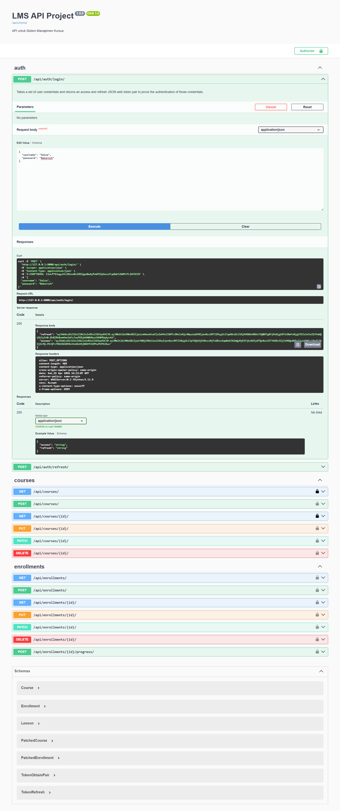
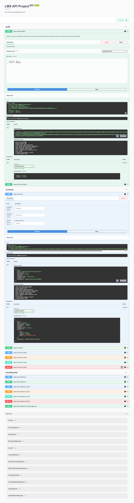

# Simple LMS - Project Foundation & API Implementation

Project ini adalah pengembangan Learning Management System (LMS) sederhana yang dibangun menggunakan **Django** dan dikontainerisasi menggunakan **Docker**. Fokus utama pada project ini adalah arsitektur backend, koneksi database, autentikasi JWT, caching, rate limiting, serta logging menggunakan MongoDB.

---

## 🎯 Fitur & Cakupan

* **Containerization:** Berjalan di atas Docker (PostgreSQL, Redis, MongoDB, Django).
* **Custom User Model:** Role-based access (Student & Instructor).
* **RESTful API:** CRUD lengkap untuk Course, Lesson, Category, dan Enrollment.
* **JWT Authentication:** Keamanan akses menggunakan JSON Web Token.
* **Redis Caching:** Optimasi performa API (course list & detail).
* **Rate Limiting:** Pembatasan request (60 request/menit per IP).
* **MongoDB Logging:** Penyimpanan activity log untuk analisis.
* **Auto-Generated Documentation:** Swagger UI untuk pengujian API.

---

## 🛠️ Persyaratan Sistem

* [Docker Desktop](https://www.docker.com/get-started)
* [Docker Compose](https://docs.docker.com/compose/install/)
* Python 3.10+
* pip

---

## 📸 Dokumentasi Sistem

### 1. Django Welcome Page & Admin

Status awal Django dan dashboard admin sebagai bukti database PostgreSQL sudah terkoneksi.


---

### 2. Log Sistem & Migrasi

Service berjalan dengan baik dan skema database berhasil terbentuk.

.png)


---

### 3. API Documentation (Swagger UI)

Seluruh endpoint API terpetakan secara otomatis dan interaktif.


---

### 4. Autentikasi & Authorization (JWT)

Proses login untuk mendapatkan access token dan penggunaannya.




---

### 5. Hasil Eksekusi Endpoint (JSON Response)

Endpoint `/api/courses/` berhasil mengambil data dari database dengan status **200 OK**.



---

### 6. Rate Limiting (Redis)

Implementasi pembatasan request menggunakan Redis.

Jika jumlah request melebihi batas (60 request/menit), sistem akan mengembalikan response:

```json
{
  "error": "Too many requests (limit 60/minute)"
}
```

Status:

```
429 Too Many Requests
```


---

### 7. MongoDB Activity Logging

Setiap request API dicatat ke MongoDB untuk keperluan monitoring dan analisis.

Contoh data log:

```json
{
  "path": "/api/courses/",
  "method": "GET",
  "user": "anonymous",
  "timestamp": "2026-06-21T13:03:55Z"
}
```

---

## 🚀 Cara Menjalankan Project

1. Clone repository:

   ```bash
   git clone <repo-url>
   cd simple-lms
   ```

2. Jalankan container:

   ```bash
   docker-compose up -d
   ```

3. Jalankan server Django:

   ```bash
   python manage.py runserver
   ```

4. Akses API:

   ```
   http://127.0.0.1:8000/api/
   ```

5. Swagger Documentation:

   ```
   http://127.0.0.1:8000/api/docs/
   ```

---

## 🧠 Arsitektur Teknologi

* **Django REST Framework** → Backend API
* **PostgreSQL** → Database utama
* **Redis** → Caching & Rate Limiting
* **MongoDB** → Activity Logging
* **Docker** → Containerization

---

## 🏁 Kesimpulan

Project ini mengimplementasikan sistem backend LMS modern dengan fitur:

* Optimasi performa (Redis caching)
* Keamanan API (JWT & Rate Limiting)
* Monitoring aktivitas (MongoDB logging)

Sehingga sistem lebih scalable, efisien, dan siap untuk pengembangan lebih lanjut.

---
